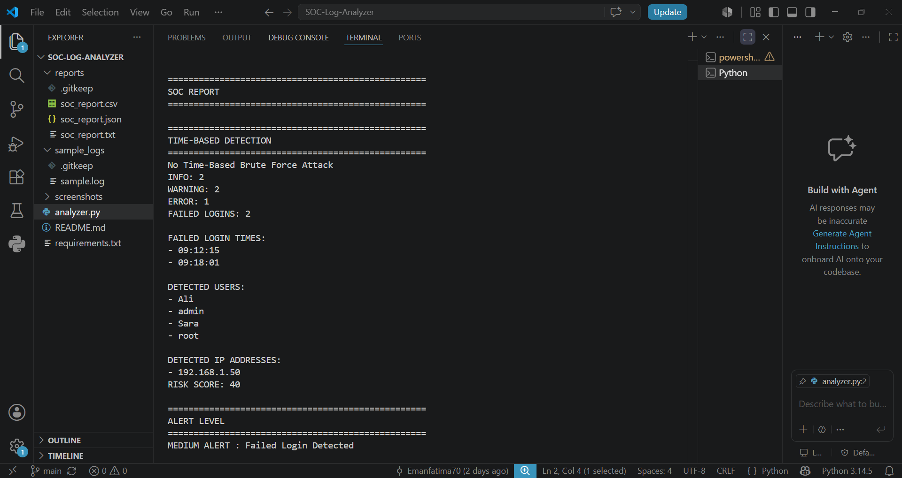

# SOC Log Analyzer


A Python-based Security Operations Center (SOC) Log Analyzer that detects suspicious activities from log files and generates professional security reports.

---

## Features

- Log File Analysis
- INFO / WARNING / ERROR Counter
- Failed Login Detection
- User Detection
- IP Address Detection
- Brute Force Detection
- Time-Based Attack Detection
- Risk Score Calculation
- Alert Level Classification
- Attack Summary Dashboard
- TXT Report Generation
- CSV Report Generation
- JSON Report Generation
- Command Line Support
- Professional Error Handling

---

## Technologies

- Python
- Regular Expressions (re)
- CSV
- JSON
- Datetime
- Command Line Arguments

---

## Project Highlights

- Built using Python
- Detects failed login attempts
- Detects suspicious IP addresses
- Calculates Risk Score
- Detects Brute Force attacks
- Detects Time-Based attacks
- Generates TXT, CSV, and JSON reports
- Supports Command Line Arguments
- Includes Professional Error Handling
- SOC-style Attack Summary Dashboard

## Project Structure

```
SOC-Log-Analyzer/
│
├── analyzer.py
├── README.md
├── sample_logs/
│   └── sample.log
│
├── reports/
│   ├── soc_report.txt
│   ├── soc_report.csv
│   └── soc_report.json
```

---


## Installation

Clone the repository:

```bash
git clone https://github.com/Emanfatima70/SOC-Log-Analyzer.git
```

Go to the project directory:

```bash
cd SOC-Log-Analyzer
```


## Run Project

```bash
python analyzer.py sample_logs/sample.log
```
---


### Analyze the default log file

```bash
python analyzer.py sample_logs/sample.log
```


### Analyze a custom log file

```bash
python analyzer.py path/to/your/logfile.log
```


## Sample Output


terminal-output-2.png

---

## Future Improvements

- Multiple Log File Analysis
- Email Alert System
- PDF Report Generation
- Splunk Integration
- SIEM Integration
- Threat Intelligence Integration

---

## Skills Demonstrated

- Python Programming
- Log Analysis
- Cybersecurity Fundamentals
- SOC Monitoring
- Detection Engineering Basics
- Regular Expressions (Regex)
- JSON & CSV Processing
- Report Generation
- Command Line Interface (CLI)
- Git & GitHub

## Author

**Eman Fatima**

Cybersecurity Student | SOC Analyst | Python | Networking | Detection Engineering 

---

## License

This project is created for educational and portfolio purposes.